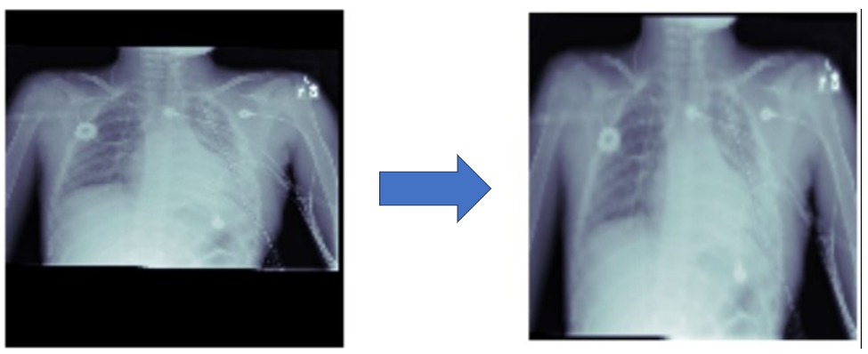
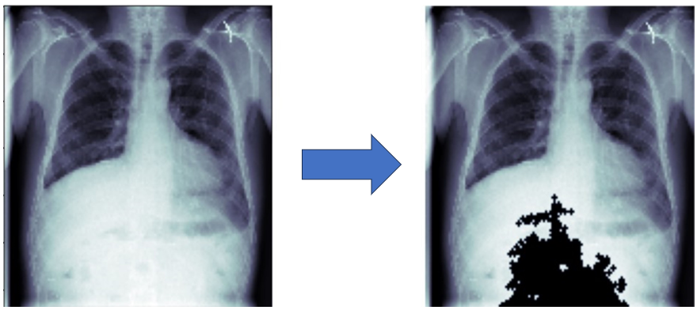
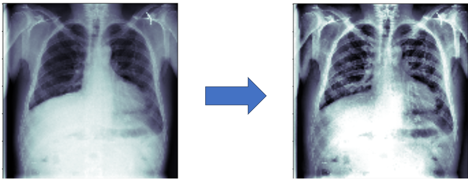

# Application of data preprocessing to improve the diagnostic efficiency of chest X-ray images
Use preprocessing techniques to highlight the lung regions to classify lung diseases

## Overview
* Use Noise Removal, Diaphragm Removal and Contrast Enrichment for data preprocessing.
* Compare different pre-trained models for classify lung diseases.

## Preprocess
For chest X-ray images, noise often appears quite a lot, which makes prediction more difficult. So I'll do Noise reduction with Bilateral filter.
### Background Removal
In chest X-ray image processing, pictures were taken with the background not fixed at the back (black screen). Therefore, removing the background helps the model to focus on the area to be observed.

### Diaphragm Removal
The data set used contains X-ray images is taken anteroposterior, so the bottom part of the image includes the area
Diaphragms with bright pixels can adversely affect the prediction of lung diseases. Therefore, a preprocessing algorithm was used to identify and remove the diaphragm area on the image. 

### Contrast Enrichment

## Experiment
I use the AUC score to evaluate the model's performance
### NIH dataset
| Model | Without Preprocessing  | Preprocessing | 
|:-------------| :-------------: | :-------------: | 
|Dense121| 49.38 | **55.46** | 
|VGG19 | 62.91 | **64.50**  | 
|EfficientNetV2| 68.81 | **69.21** |
|ConvNeXt | 75.60 | **77.22** |

### CheXpert-small
| Model | Without Preprocessing  | Preprocessing | 
|:-------------| :-------------: | :-------------: | 
|Dense121| 65.16 | **68.39** | 
|VGG19 | **63.59** | 60.98  | 
|EfficientNetV2| 66.45 | **68.64** |
|ConvNeXt | 68.21 | **73.84** |

